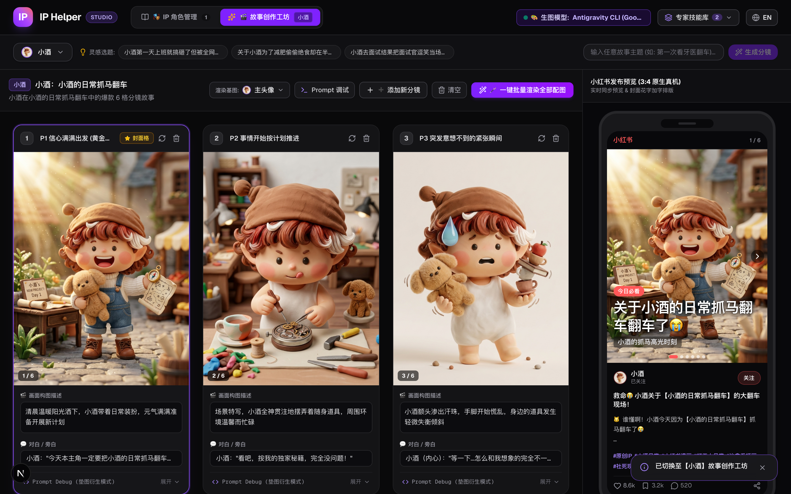
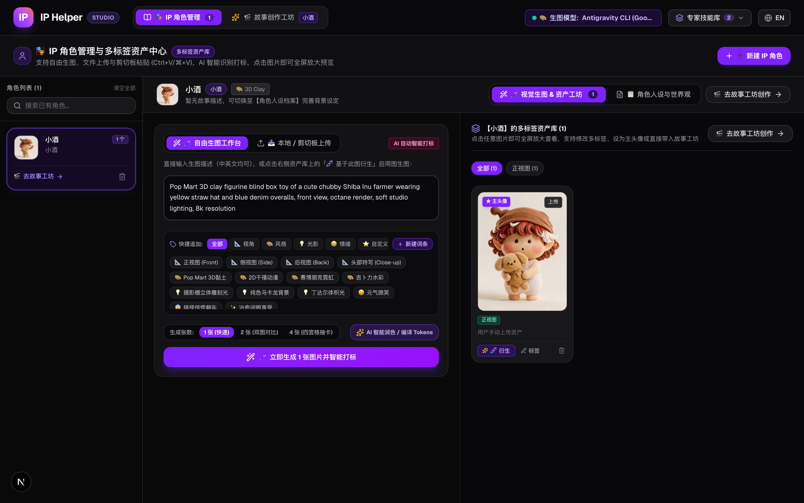
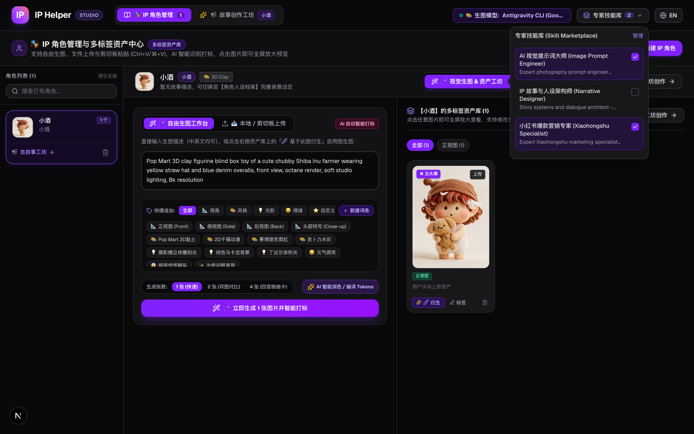
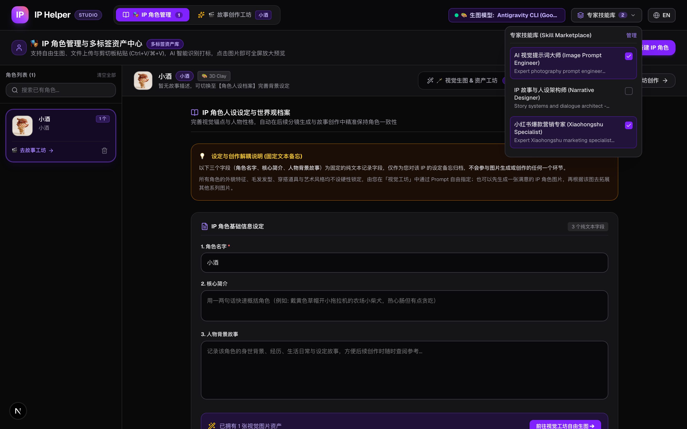

# 🎨 IP Helper (灵感绘境)
> **原创 IP 角色全生命周期管理与小红书 6 格条漫智能创作工坊**
> 
> *Consistent AI Character Management & Viral Xiaohongshu Storyboard Studio Powered by Next.js & Antigravity AI Engine.*

---

## 🌟 项目亮点概览 (Key Highlights)

- 🎭 **IP 角色一致性基准库**：支持主头像、三视图（正/侧/背）、情绪表情包、LoRA 权重微调与视觉锚点（发型、服装、配色方案）锁定。
- 🎬 **小红书 6 格爆款条漫画布**：遵循社交媒体爆款传播规律（黄金三秒吸睛封面 ➔ 铺垫 ➔ 渐进 ➔ 翻车高潮 ➔ 社死定格 ➔ 治愈收尾与评论区求互动）。
- 🖼️ **图生图一致性衍生管线 (Image-to-Image)**：支持自由选择角色的主头像或任意立绘作为分镜垫图基准，确保各分镜角色外貌与画风高度统一。
- 🛡️ **四重渲染防串格与排障诊断体系**：内建双向 Prompt 特征签名校验、服务端全局 FIFO 串行执行队列、启动前会话快照与透明的排障诊断日志号 (Log ID)。
- 🧠 **热插拔多领域专家技能库 (Skills Hub)**：集成小红书营销专家、AI 提示词大师与 IP 故事架构师，随项目打包上线并可自由组合注入生成上下文。
- 📜 **商业级 IP 设定圣经 (IP Bible)**：一键生成与预览角色的世界观背景、性格冲突、商业授权规格与版权声明。

---

## 📸 界面效果与功能展示 (Screenshots & Features)

### 1. 故事创作与智能分镜工坊 (AI Story Studio & Canvas)
> 基于选定 IP 与日常抓马灵感，通过左侧 AI 创意伙伴对话一键生成 6 格爆款小红书条漫分镜，全景联动中间分镜画布与右侧小红书移动端预览。



---

### 2. 6 格小红书爆款分镜画布 (Storyboard Canvas)
> 严格遵循爆款社交条漫叙事节奏，支持分镜垫图衍生模式、单格独立重新生成与一键批量渲染。



---

### 3. IP 角色管理与视觉资产库 (Character Manager)
> 集中管理 IP 角色的多维度设定、3D 黏土/吉卜力/美式复古画风预设、视觉锚点与多角度立绘资产。



---

### 4. Prompt 调试抽屉与全链路排障诊断 (Prompt Debug & Trace Diagnostics)
> 实时展开最终发送给模型的英文生图词，支持即时微调、负向词预览以及会话绑定排障编号与状态跟踪。


---

### 5. 专家技能库配置面板 (Domain Skills Hub)
> 维护在项目源码 `skills/` 目录下的多领域专家技能，支持热插拔与灵活启闭，赋能 AI 智能体拥有专业的内容策划能力。


---

### 6. IP 人设与世界观设定工坊 (Personality & Worldview)
> 结构化配置 IP 视觉标准、性格冲突、经典口头禅与世界观背景设定，确保全分镜情节与人设高度吻合。



---

## 🛠️ 技术架构 (Tech Stack)

| 层级 | 技术选型 | 说明 |
| :--- | :--- | :--- |
| **前端框架** | **Next.js 16 (App Router)** | 基于 React 19、TypeScript 构建的高性能响应式 Web 应用 |
| **构建工具** | **Turbopack** | 极速增量编译与模块热重载 |
| **样式与图标** | **Tailwind CSS + Lucide Icons** | 现代暗色系（Dark Theme）专业工作台 UI |
| **生图引擎** | **Antigravity CLI (`agy -p`)** | 无头子进程自动调度 Google Imagen 商业级原画渲染 |
| **提示词工程** | **Prompt Purification Engine** | 中文语义提炼 ➔ 英文画风编译 ➔ 负向提示词注入 |
| **队列与并发** | **Server FIFO Render Queue** | 服务端自动串行化调度，彻底避免并发竞争与接口限流 |
| **数据持久化** | **File-based JSON Storage** | 纯文件系统持久化存储（带开发/测试环境沙箱完全隔离） |
| **自动化测试** | **Vitest + Playwright** | 涵盖 47+ 项单元测试、集成测试与端到端黑盒验证 |

---

## 🚀 快速上手 (Quick Start)

### 1. 克隆代码与安装依赖
```bash
git clone https://github.com/your-username/ip_helper.git
cd ip_helper

# 使用 pnpm 安装依赖 (推荐)
pnpm install
```

### 2. 启动本地开发服务
```bash
pnpm dev
```
启动完成后，在浏览器打开 [http://localhost:3000](http://localhost:3000) 即可开始创作。

---

## 🧪 运行测试与生产打包 (Testing & Build)

### 运行全套单元与集成测试
```bash
pnpm test
```

### 生产环境打包编译
```bash
pnpm build
```

---

## 🌐 线上部署说明 (Deployment Guide)

本项目支持两种主流部署形态：

1. **开发者私有化本地部署 (Local Self-Host - 推荐)**：
   - 开发者或创作者直接在本地机器运行，系统自动无缝调用本机已登录的 `agy` CLI，零权限门槛。
2. **云服务器/容器公共部署 (Cloud / Docker)**：
   - 部署在 Linux VPS 或 Docker 容器中，由服务端统一调度全局队列执行生图，多用户并发时自动排队。

---

## 📂 项目目录结构 (Directory Structure)

```text
ip_helper/
├── data/                    # 本地持久化数据存储 (支持 .test_data 隔离)
│   ├── ip_profiles.json     # IP 角色资产与设定数据
│   ├── stories.json         # 分镜故事与渲染画作数据
│   └── logs/                # 排障诊断日志记录 (LOG-*.json)
├── docs/                    # 项目文档与高清截图
│   └── images/              # README 展示截图
├── skills/                  # 专家技能库 (SKILL.md)
│   ├── agency-xiaohongshu-specialist/
│   ├── agency-image-prompt-engineer/
│   └── agency-narrative-designer/
├── src/
│   ├── app/                 # Next.js App Router 路由与 API
│   │   ├── api/render/      # 服务端生图与队列调度接口
│   │   ├── api/story/       # 分镜故事数据持久化接口
│   │   └── api/skills/      # 专家技能加载接口
│   ├── components/          # React 核心组件 (Canvas, Studio, Modals)
│   ├── lib/
│   │   ├── agent/           # AI 剧本生成与提示词编排引擎
│   │   ├── db/              # 文件持久化与测试环境沙箱路由
│   │   ├── render/          # CLI 调度、队列、签名校验与模型适配
│   │   └── skills/          # SKILL.md 动态解析与注入器
│   └── __tests__/           # 自动化测试套件 (47+ Tests)
└── package.json
```

---

## 📄 开源许可证 (License)

本项目采用 [MIT License](LICENSE) 开源许可证。
